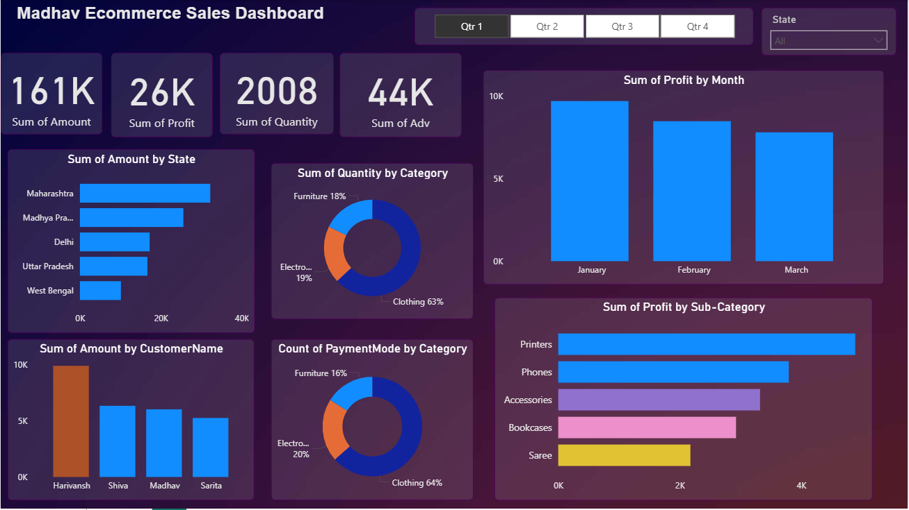

# 🛒 Madhav Ecommerce Sales Dashboard (Power BI)

## 📊 Overview
An interactive Power BI dashboard designed to analyze and visualize e-commerce sales data across multiple dimensions such as category, customer, and region.  
The project demonstrates data modeling, DAX measures, and KPI tracking to support data-driven decision-making — ideal for business analysis and reporting use cases.

---

## 🧾 Dataset Description
The dashboard uses two Excel datasets:

- **Orders.xlsx** → Contains `Order ID`, `Order Date`, `Customer Name`, `State`, `City`
- **Details.xlsx** → Contains `Order ID`, `Amount`, `Profit`, `Quantity`, `Category`, `Sub-Category`, `Payment Mode`

Both tables are linked via the `Order ID` field for accurate relational analysis.

---

## 📈 Dashboard Insights
- Maharashtra recorded the highest total sales.  
- Clothing contributed 63% of total quantity sold.  
- Printers and Phones emerged as top-performing sub-categories.  
- Added Quarter and State slicers for real-time KPI filtering.

---

## 🧠 Key Learnings
- Power BI data modeling and relationship building  
- Writing DAX formulas for calculated fields  
- Designing interactive visuals for effective storytelling  
- Generating business insights for decision support  

---

## 🛠️ Tools & Technologies
- Power BI Desktop  
- Microsoft Excel  
- DAX (Data Analysis Expressions)  

---

## 💡 Outcome
Delivered a professional, insight-rich dashboard that demonstrates the use of Power BI for business analytics — improving visibility into performance metrics and aiding data-driven strategy.

---

## 📷 Dashboard Preview
(Add your dashboard screenshot here)

